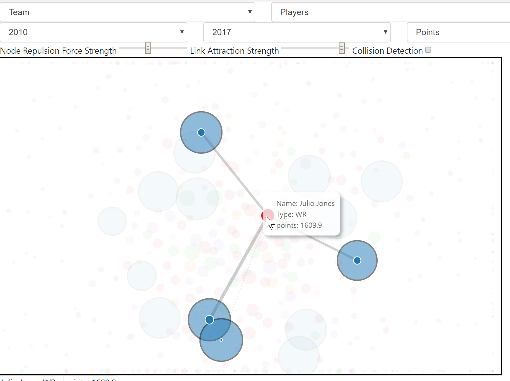
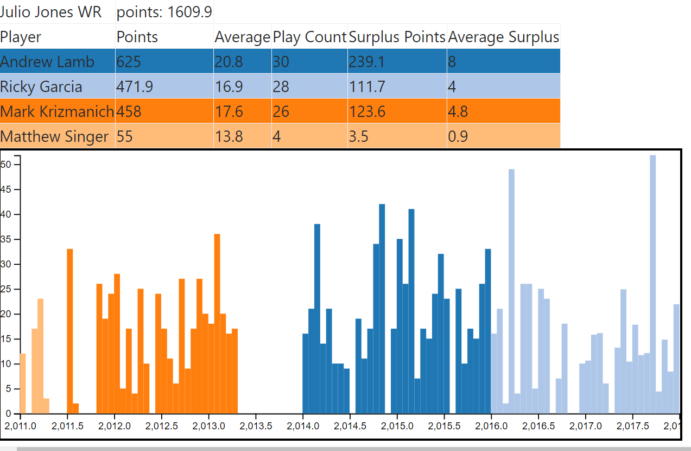

# Personal Fantasy Football Charts

These are two interactives I made for my fantasy football league for fun

### Node-Link Graph

[Link](https://htmlpreview.github.io/?https://github.com/jjburke3/personal_fantasy_football/blob/master/node-link.html)

An interactive of all points scored in league history, with each node represnting players and teams, and each link showing that points that player has scored for that teams

Clicking on a node will grey out all unaffliated nodes, and show a circle showing link strength for all affiliated nodes

It will also create a table and graph underneath the main visualization

### Points Line Graph

[Link](https://htmlpreview.github.io/?https://github.com/jjburke3/personal_fantasy_football/blob/master/la_liga_port_lodge.html)

A line graph showing points scored or wins by team for either each year or cumulatively

## Built With

* [d3.js](https://d3js.org/) - Javascript Library for Manipulating Data
* [Bootstrap](https://getbootstrap.com/) - Frontend Webframe Work

