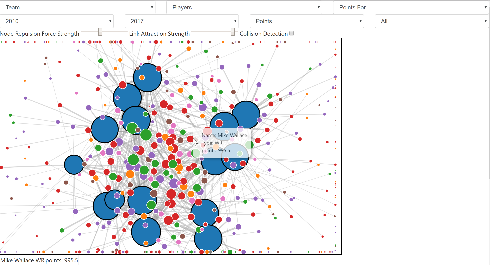
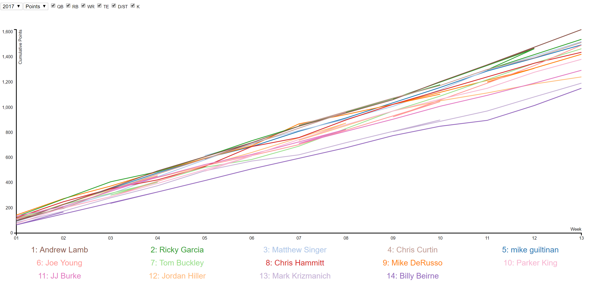

# Personal Fantasy Football Charts

These are two interactives I made for my fantasy football league for fun

### Node-Link Graph

An interactive of all points scored in league history, with each node represnting players and teams, and each link showing that points that player has scored for that teams

### Points Line Graph

A line graph showing points scored or wins by team for either each year or cumulatively

## Built With

* [d3.js](https://d3js.org/) - Javascript Library for Manipulating Data
* [Bootstrap](https://getbootstrap.com/) - Frontend Webframe Work

